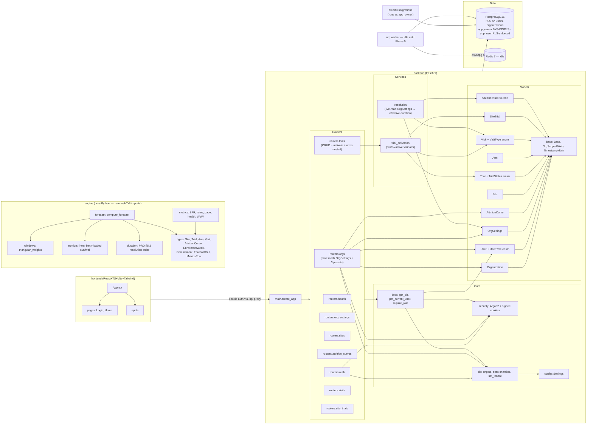

# Architecture — dependency diagram

Per CLAUDE.md golden rule #4, this diagram is **updated every phase**. If a module isn't on the diagram, it isn't done. The goal is to make orphaned or isolated modules obvious at a glance.

**Last refreshed:** 2026-05-28 (Phase 0 ✅ · Phase 1 ✅ · Phase 2 🟡 deliverables done, awaiting smoke)

## Top-level system

## Notes

- **`engine`** has internal structure now (forecast + metrics + helpers + types) but still no *outgoing* edges to anything outside the package — that's enforced by `tests/test_engine_purity.py` (walks every submodule and asserts no forbidden imports leaked into `sys.modules`). It'll get an *incoming* edge from the backend in Phase 4 (forecast wiring). Until then it remains in-tree but deliberately decoupled per CLAUDE.md golden rule #2.
- **`OrgSettings`** is now wired (Phase 2). The resolution service reads it live on every call — a PATCH to its duration fields immediately re-flows to every inheriting trial/visit. Explicit overrides at the visit or site-trial level are preserved.
- **`AttritionCurve`** is the only org-scoped table whose RLS policy admits NULL `org_id` rows (for future global seeds). No global seeds ship in v1; the column shape is in place.
- **Service layer** (`app/services/`) is new in Phase 2. `resolution.py` is intentionally the same shape as `engine/duration.py` — Phase 4 will use it to build the `OrgDurationDefaults` dataclass that gets handed into the engine. `trial_activation.py` returns a structured failure list rather than fail-fast, so the wizard UI in Phase 5 can surface every blocker together.
- **`arq worker`** has no work yet but the container is wired so the Phase 5 hookup (Claude vision SoA parser) is a code change, not infra.
- **Two-role DB split** (`app_owner` BYPASSRLS for Alembic, `app_user` RLS-enforced at runtime) is what makes tenant isolation auditable, not just intended.
- Every domain model inherits `OrgScopedMixin` (carries `org_id`) except `Organization` itself.
- Every request runs inside a transaction with `SET LOCAL app.current_org_id = '<uuid>'`; RLS policies on each org-scoped table read that via `current_setting('app.current_org_id')`.
- The `/auth/login` route binds the requested `org_id` as the tenant *before* the user lookup so RLS doesn't hide the row being authenticated against — UUIDs aren't enumerable, so this doesn't leak.
- Frontend dev hits the backend via Vite's `/api` proxy, keeping both on the same origin in dev so the session cookie round-trips without CORS gymnastics.
