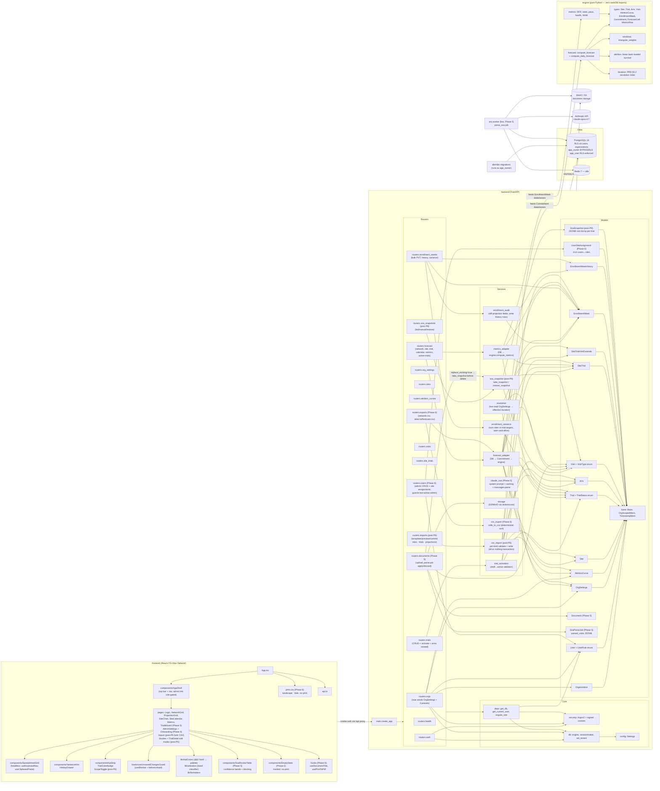

# Architecture — dependency diagram

Per CLAUDE.md golden rule #4, this diagram is **updated every phase**. If a module isn't on the diagram, it isn't done. The goal is to make orphaned or isolated modules obvious at a glance.

**Last refreshed:** 2026-06-24 (Phase 0 ✅ · Phase 1 ✅ · Phase 2 ✅ · Phase 3 ✅ · Phase 4 ✅ · Phase 5 ✅ · Phase 6 ✅ · post-P6: bulk CSV import + Studies dashboard + SoA snapshots)

## Top-level system

## Notes

- **`engine`** is now wired (Phase 4) via `forecast_adapter` and `metrics_adapter`. The engine still has **no outgoing edges** outside the package — that's enforced by `tests/test_engine_purity.py`, which still passes after wiring. CLAUDE.md golden rule #2 holds. The adapters are the *only* modules that touch both worlds: they read SQLAlchemy ORM objects from Postgres, convert them to the engine's plain frozen dataclasses (`Commitment`, `EnrollmentWeek`, etc.), and hand them to the engine.
- **`OrgSettings`** is now wired (Phase 2). The resolution service reads it live on every call — a PATCH to its duration fields immediately re-flows to every inheriting trial/visit. Explicit overrides at the visit or site-trial level are preserved.
- **`AttritionCurve`** is the only org-scoped table whose RLS policy admits NULL `org_id` rows (for future global seeds). No global seeds ship in v1; the column shape is in place.
- **Service layer** (`app/services/`) is new in Phase 2. `resolution.py` is intentionally the same shape as `engine/duration.py` — Phase 4 will use it to build the `OrgDurationDefaults` dataclass that gets handed into the engine. `trial_activation.py` returns a structured failure list rather than fail-fast, so the wizard UI in Phase 5 can surface every blocker together. Phase 3 added `enrollment_audit.py` (one history row per *changed* projection field; actuals are never audited) and `enrollment_variance.py` (PRD §7.3 warn-and-allow, never blocks).
- **SpreadsheetGrid** (frontend, Phase 3) is built generic over a row shape. Phase 4's NetworkGrid uses a purpose-built `<table>` instead — sites-as-rows × weeks-as-columns with hover tooltips and click-to-drill was different enough that a dedicated component was clearer than over-loading the spreadsheet primitive. Both serve different needs; both are well-tested.
- **Trial colors are deterministic** (`lib/trialColors.ts`, djb2 hash of `trial_id` → fixed 12-color palette). Same color everywhere — network legend, per-site chart series, trial-detail header, metrics-page badges. No DB column needed.
- **`/active-trials`** lives at the top level, **not** at `/trials/active`. FastAPI matches `/trials/{trial_id}` first and would try to parse "active" as a UUID. Caught during Phase 4 smoke; named to be self-documenting. Post-P6 it takes a `scope` param so the legend matches the plotted scope.
- **Forecast scope** (post-P6, PRD §6.9) is the single seam where trial status selects what's forecast. `forecast_adapter.ForecastScope` (active/planned/combined) → `scope_statuses()` → `build_commitments(statuses=…)`. Every forecast/metrics/export endpoint threads one `scope` query param (default `active`, preserving prior behavior); the frontend `ScopeToggle` drives it. The `planned` status (future pipeline) is forecast with the *same* engine math as `active` — the engine never learns about status, so golden rules #2/#5 are untouched.
- **`useUnsavedChangesGuard`** is the project-wide form-exit guard (per saved feedback memory: every Save-button form must use it). Hooks into React Router 6's `useBlocker` for in-app navigation and `beforeunload` for tab close. Phase 5's trial setup wizard and Phase 6's admin settings page will both reuse it.
- **`arq worker`** is now live (Phase 5). One job: `parse_soa(document_id, org_id, parse_job_id)` pulls the PDF from S3/MinIO, calls Claude with the cached system prompt, persists `parsed_visits` + `raw_output` to the `SoaParseJob` row. Failures get a `failed` status with the error message so the user can retry.
- **`Document` / `SoaParseJob`** (Phase 5) keep AI output **out** of the engine until the user confirms. The engine reads `Visit` rows; `parsed_visits` stays in JSONB until the apply endpoint creates real Visit rows from the user's *edited* payload. This is the PRD §10.2 mitigation made structural.
- **`claude_soa`** is the only module that holds the SoA system prompt. Versioned via `PROMPT_VERSION`. The Anthropic client is dependency-injected so tests pass a mock; the real API is only called from the worker (and the manual smoke).
- **`storage`** wraps `aiobotocore`. Same code path serves AWS S3 (prod) and MinIO (dev) — only the endpoint URL differs. Bucket is created idempotently by the `minio-init` one-shot in docker-compose.
- **Two-role DB split** (`app_owner` BYPASSRLS for Alembic, `app_user` RLS-enforced at runtime) is what makes tenant isolation auditable, not just intended.
- Every domain model inherits `OrgScopedMixin` (carries `org_id`) except `Organization` itself.
- Every request runs inside a transaction with `SET LOCAL app.current_org_id = '<uuid>'`; RLS policies on each org-scoped table read that via `current_setting('app.current_org_id')`.
- The `/auth/login` route binds the requested `org_id` as the tenant *before* the user lookup so RLS doesn't hide the row being authenticated against — UUIDs aren't enumerable, so this doesn't leak.
- **Users router** (Phase 6) carries the "cannot remove the last active Org Admin" guard. Demoting role or setting `active=false` on the last active admin returns 409. Caught by `test_cannot_remove_last_active_admin`; counter-test confirms an admin *can* demote self when a second admin exists.
- **Exports** (Phase 6) are CSV-only. Same `forecast_adapter` that feeds the network/site views also feeds `csv_export.cells_to_csv` (deterministic sort by `(site_id, week_start)`). PDF export is **client-side** (`window.print()` + `print.css`) — no server-side renderer in v1.
- **`UserSiteAssignment`** (Phase 6) is the m:m table behind site-scoped roles. Org-scoped via `OrgScopedMixin` like every other domain table; RLS policy follows the standard pattern.
- **Render blueprint** (`render.yaml`) is checked in but **not applied**. The deploy is intentionally deferred — first-time deploy follows `docs/deploy.md`.
- **Bulk CSV import** (`routers/imports.py` + `services/csv_import.py`, post-P6) is the org_admin shortcut to load many sites / trials / projections at once. Preview is a server-side dry-run; commit re-validates and writes in **one DB transaction** (all-or-nothing — `csv_import.commit_*` returns the same shape as preview, the router converts errors into a 422 with `{detail: {errors: [...]}}`). FK resolution by **name within org** is what makes a hand-edited spreadsheet usable; unknown names → preview error rather than a silent skip. Trial imports always land in `draft` status — activation stays with the wizard's validator (PRD §6.2).
- **SoA snapshots** (`models/soa_snapshot.py` + `services/soa_snapshot.py` + `routers/soa_snapshots.py`, post-P6) are JSONB dumps of every Visit row across every Arm of a trial at a moment in time. Created automatically before a re-parse-replace (so a bad LLM redo is reversible) and manually from the TrialDetail edit screen. Restore writes the snapshot's visits back to the arm by **matching arm name** (so an arm-rename doesn't break the restore), after first taking a `pre_restore` snapshot — restores are themselves reversible.
- **Studies dashboard** (`pages/Studies.tsx`, post-P6) sits at `/studies` and is the entry point to per-trial editing. Linked from the Studies nav item between Network and Metrics. The dashboard groups trials by status (Active / Draft / Archived) and links each into the existing `TrialDetail` page, which gained edit affordances (metadata modal, inline SoA editing, re-parse from PDF, snapshot history) gated to `org_admin` / `ops_lead`. The active-trial warning banner is *informational, not blocking* — the live-resolution model (PRD §5.2) makes everyday edits on active trials the expected case.
- Frontend dev hits the backend via Vite's `/api` proxy, keeping both on the same origin in dev so the session cookie round-trips without CORS gymnastics.
